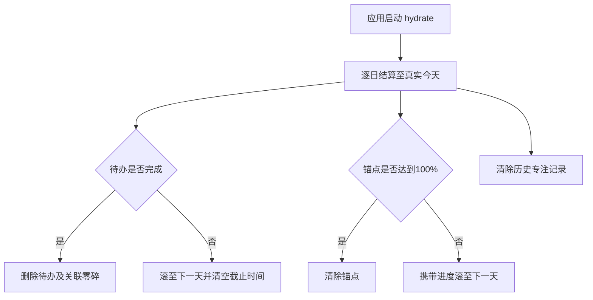

拾光 v1.0 PRD

版本：v1.0
状态：已完成真机验收并发布线上版本
更新时间：2026-07-26
产品形态：微信小程序，本地优先

1. 文档目的与依据

本 PRD 定义拾光 v1.0 的问题边界、成功标准、产品范围、关键业务规则和验收口径，供产品、设计、开发和测试共同使用。

本文件中的内容分为三类：

- 用户事实：来自一位典型用户的深度访谈。
- 产品决策：已根据访谈和当前迭代确定、应由本版本实现的规则。
- 待验证假设：尚不能视为普遍结论，需通过真机测试和一周真实使用验证。

2. 背景与问题

2.1 用户事实

目标用户会在工作、聊天、健身和放空时频繁冒出待办、灵感、复盘想法或无关念头。用户愿意记录，但常把记录推迟到晚上写日记；日记需要安静、私密、不受打扰的环境，因此启动成本高。

现有替代方式不能形成顺畅闭环：

| 替代方式 | 能解决的问题 | 未解决的问题 |
| --- | --- | --- |
| 备忘录 | 可自由记录文字 | 内容与购物清单、稿件、旅行攻略混杂；想法转为待办要切换应用。 |
| 系统日历 | 可管理明确时间事件 | 当天待办不直观；日视图需要滚动；无截止时间事项不会自然延续到次日。 |
| 晚间日记 | 可深度表达和整理 | 不适合灵感或小事出现的当下。 |

用户明确的结果期待是：使用一周后，能感到“我明显少忘事了”，尤其是临时想到的小待办。

2.2 问题陈述

零碎想法高频的个人用户，在想法出现时缺少一个低摩擦、不中断当前状态的入口；即使记录下来，也难以将需要行动的小事稳定带回当天视野，导致注意力被占用、内容散落和待办被遗忘。

2.3 v1.0 目标

在不要求登录、云同步或复杂规划的前提下，让用户：

1. 在约 30 秒内记录并分类一条零碎内容。
2. 在同一入口将内容转为待办，无需切换应用。
3. 打开首页即可看到当天需要处理的锚点与待办。
4. 用轻量专注计时启动一段连续工作，并暂存分心内容。
5. 确信正文仅保存在本机，并能自行导出和导入数据。

2.4 非目标

- 不做完整日历、项目管理或长期计划工具。
- 不做日记替代品、情绪陪伴或 AI 自动整理。
- 不以完成率、连续打卡或统计看板驱动用户。
- 不承诺用通知替代用户主动查看；v0.1 不提供系统提醒。

3. 目标用户与使用场景

3.1 目标用户

零碎想法高频的个人行动与思考管理用户：有记录意愿，能分辨随想、灵感、待办、分心和复盘，但不愿在想法出现时进入重度整理流程；更关心今天该做什么，不希望为七天以后的事项投入心力。

3.2 核心场景

| 场景 | 用户任务 | 成功体验 |
| --- | --- | --- |
| 工作、聊天、健身或放空时冒出想法 | 快速卸下脑内占用 | 打开捕捉卡片后可立即输入、保存。 |
| 输入中意识到“这件事要做” | 将内容变为行动 | 在同一流程选择待办，并决定有无截止时间。 |
| 早晨或工作间隙打开应用 | 确认今天要做什么 | 首页优先呈现今天的锚点和未完成待办。 |
| 需要强迫自己进入连续工作 | 开始一轮专注 | 写下本轮小事、选择时长并开始计时。 |
| 专注中出现无关念头 | 暂存分心，不中断工作 | 同页记录分心，之后能在零碎中回看和处理。 |

4. 产品定位与原则

4.1 一句话定位

拾光是一个本地优先的私人注意力助理，通过“30 秒记录、当天看见、围绕锚点推进、用番茄钟回到当前行动”接住零碎思绪。

4.2 产品原则

- 少忘事优先：优先保障临时小待办被接住、重新看见和完成。
- 低摩擦先于完整结构：先保存一句话，再分类和分流；不引入项目、标签等重结构。
- 持续可见，不施压：未完成事项自然延续，不展示拖延天数或评价用户。
- 首页是行动面板：今天的锚点和待办优先于统计和内容浏览。
- 本地与可控优先：正文不上传；备份、导入和匿名统计均由用户控制。

5. 范围与信息架构

5.1 平台与技术边界

| 项目 | v0.1 决策 |
| --- | --- |
| 平台 | 仅微信小程序。 |
| 技术栈 | uni-app、Vue 3、TypeScript、Pinia、Vitest、微信小程序本地存储。 |
| 数据 | 无账号、无云同步；用户正文及业务数据仅本地保存。 |
| 导航 | 首页、零碎、专注三栏。 |

5.2 页面职责

| 页面 | 主要任务 | 必须包含 |
| --- | --- | --- |
| 首页 | 查看和处理当日行动 | 七日日期轴、当日锚点、待办、快速捕捉、快速进入专注、引导和数据管理。 |
| 零碎 | 创建、收纳和编辑思绪 | 分类选择、输入、全部/分类筛选、全文列表、编辑和删除。 |
| 专注 | 管理当天锚点并完成一次专注 | 锚点、当日专注汇总、专注历史、番茄钟、分心捕捉。 |

6. 功能需求与业务规则

6.1 快速捕捉与零碎
*用户故事：当我脑中冒出内容时，我希望立刻写下来并分类，从而不再反复惦记它。

| 编号 | 需求 |
| --- | --- |
| FR-S-01 | 首页提供简洁的“快速捕捉”入口；点击后打开居中卡片，卡片最大宽度为 420px。 |
| FR-S-02 | 卡片打开后输入框自动聚焦并唤起键盘；卡片包含分类选择、输入框和保存按钮。 |
| FR-S-03 | 每条零碎必须有一个分类：随想、灵感、待办、分心、复盘；快速捕捉默认选中随想。 |
| FR-S-04 | 零碎页默认展示全部内容；全部与分类视图均按创建时间倒序，长文本不截断。 |
| FR-S-05 | 用户可编辑零碎正文、修改分类或删除记录。 |
| FR-S-06 | 当前版本不提供关键词搜索。 |

6.2 待办

**用户故事**：当一条内容需要行动时，我希望它能立即进入相应日期的待办，而不是散落在另一个应用或脑中。

| 编号 | 需求 |
| --- | --- |
| FR-T-01 | “日程”与“待办”统一为待办；首页仅可选择真实今天至未来第 6 天，共 7 天。 |
| FR-T-02 | 用户新建或将零碎改为待办时，必须选择有无截止时间。无截止时间进入当天待办；有截止时间进入指定日期和时刻的待办。 |
| FR-T-03 | 未完成、有截止时间待办按截止时间升序；未完成、无截止时间待办按创建时间倒序；已完成待办按完成时间倒序。 |
| FR-T-04 | 完成待办后，条目在当日保留；再次点击完成状态可恢复为未完成。 |
| FR-T-05 | 跨日结算时，未完成待办滚至下一天并清空原截止时间；完成待办及其关联零碎删除。 |
| FR-T-06 | 待办与“零碎-待办”双向关联，正文、分类、完成状态和删除保持同步。 |
| FR-T-07 | 待办改为其他分类时退出待办列表；其他分类改为待办时创建关联待办。 |
| FR-T-08 | 当前不发送截止时间提醒或系统通知。 |

6.3 锚点

**用户故事**：当我有一件需要投入当天较多时间的大事时，我希望把它作为锚点并自行判断进展。

| 编号 | 需求 |
| --- | --- |
| FR-A-01 | 锚点仅为当天创建，每天最多两个；新建锚点位于上方，位置创建后固定。 |
| FR-A-02 | 锚点包含一句话内容和手动进度条；进度可精确调整至 1%，初始为 0%。 |
| FR-A-03 | 用户可修改或删除锚点；删除后立即释放名额。 |
| FR-A-04 | 次日结算时，100% 锚点清除；未达 100% 的锚点保留进度滚至下一天并占用名额。 |

6.4 专注与分心

用户故事：当我需要进入一段连续工作时，我希望用计时建立开始仪式，并把中途出现的杂念先放下。

| 编号 | 需求 |
| --- | --- |
| FR-F-01 | 创建番茄钟前，用户填写“本轮小事”；该内容不关联待办或锚点。 |
| FR-F-02 | 提供 15、25、45 分钟快捷时长和 1–180 分钟自定义时长。 |
| FR-F-03 | 支持开始、暂停、继续、完成、放弃，以及到点后延长 5 分钟。 |
| FR-F-04 | 实际专注时长由真实时间戳推导；切页、后台或锁屏返回后，显示正确剩余时间。暂停时长不计入实际专注。 |
| FR-F-05 | 完成、自然结束和放弃均生成普通当日历史，只显示实际专注时长和本轮小事，不额外标记“放弃”。 |
| FR-F-06 | 专注历史仅保留当天，可修改事项或删除。专注页提供当日专注时长汇总和打开历史的中央模态卡片。 |
| FR-F-07 | 专注中的分心内容保存为当天“零碎-分心”；可在零碎页修改、改分类或删除。 |
| FR-F-08 | v0.1 不提供后台或锁屏结束通知。 |

6.5 数据管理、隐私与引导

| 编号 | 需求 |
| --- | --- |
| FR-D-01 | 用户正文和业务数据仅保存在本地，不上传供开发团队查看。 |
| FR-D-02 | 用户可导出包含完整状态的 JSON，也可将 JSON 合并导入当前本地数据。 |
| FR-D-03 | 导入不覆盖本地数据；文本完全一致的待办或零碎视为重复，保留本地版本。 |
| FR-D-04 | 清空本地数据必须二次确认。 |
| FR-D-05 | 首次打开时展示一次三步引导：快速捕捉、今日待办、专注与分心。关闭后不再自动出现；首页保留重新打开引导的入口。 |
| FR-D-06 | 匿名行为或错误统计不得包含正文，且是否上传由用户自行决定。 |

7. 核心流程与状态

7.1 零碎转待办

7.2 跨日结算

8. 成功指标与验证

8.1 成功标准

| 类型 | 指标 | 判定方式 |
| --- | --- | --- |
| 核心结果 | 用户是否“明显少忘事” | 一周真实使用后的访谈，结合用户仍忘记的临时小待办实例。 |
| 核心行为 | 快速捕捉可在约 30 秒内完成 | 可用性测试中观察从入口到保存的完成时长和中断情况。 |
| 行动承接 | 待办能被再次看见并完成 | 记录捕捉后变为待办、回到首页查看、最终完成的实例链路。 |
| 专注体验 | 计时与分心记录不造成额外中断 | 观察一轮专注中开始、暂停、后台返回与分心捕捉的完成情况。 |
| 信任基础 | 用户理解本地存储和备份 | 访谈确认用户能说清正文位置、导入导出作用和边界。 |

8.2 v0.1 验收

自动化测试和构建不能替代真机验收。体验版需至少覆盖：

1. 快速捕捉弹窗自动聚焦，分类、待办截止时间、保存和遮罩关闭均可用。
2. 待办的排序、完成恢复、零碎双向同步和跨日结算符合第 6.2 节。
3. 锚点上限、进度、编辑删除和跨日继承符合第 6.3 节。
4. 番茄钟开始、暂停、继续、完成、放弃、后台/锁屏返回和历史弹窗均可用。
5. 窄屏、常规屏与 Pura X 外屏模式没有按钮被遮挡或不可点击。
6. 导出、合并导入、重复保留本地版本及二次确认清空均符合第 6.5 节。

9. 不做与后续观察

9.1 v1.0 不做

- 登录、云同步、多设备协作。
- 系统提醒、截止时间通知。
- AI 整理、情绪识别、情绪陪伴。
- 标签、项目体系、重复待办、复杂日历拖拽、复杂统计。
- 零碎关键词搜索。
- Windows、PC、iOS 或 Android 原生客户端。

9.2 待验证假设与风险

| 假设或风险 | 验证方式 |
| --- | --- |
| 七天边界足够覆盖用户近期安排 | 一周试用中记录是否出现必须记录七天后事项的情况。 |
| 分类筛选足够支持当前回找需求 | 观察用户回找失败、回找耗时或主动索要搜索的频率。 |
| 同文去重不会误合并不同语义记录 | 用真实导入样本检查保留和误合并情况。 |
| 次日清除完成待办和专注历史不影响回顾 | 访谈用户是否需要跨日追溯这些记录。 |
| 无系统提醒仍能满足时间敏感待办 | 观察有截止时间待办的遗漏原因。 |

10. 版本决策记录

| 决策 | 原因 |
| --- | --- |
| 三栏导航，不设独立日程页 | 首页已能完整承接当前待办与锚点；减少入口和切换。 |
| 快速捕捉采用自动聚焦模态卡片 | 让用户从点击后立刻进入输入，降低记录启动成本。 |
| 待办与零碎双向关联 | 既保留思绪的收纳路径，也让需要行动的内容进入今天。 |
| 无截止时间待办跨日延续 | 补足系统日历全天事项不自动延续的缺口。 |
| 锚点与待办分离 | 锚点表达当天需大量投入的大事，不是待办优先级标签。 |
| 专注历史仅保留当天 | 当前阶段服务当天行动，避免过早扩展为统计产品。 |
| 本地优先且提供 JSON 备份 | 回应用户对正文可见性和换机迁移的担忧。 |
